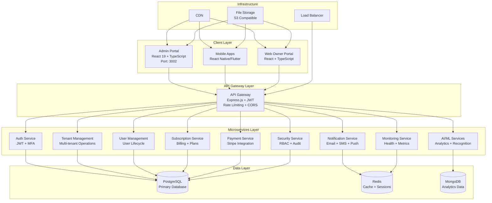
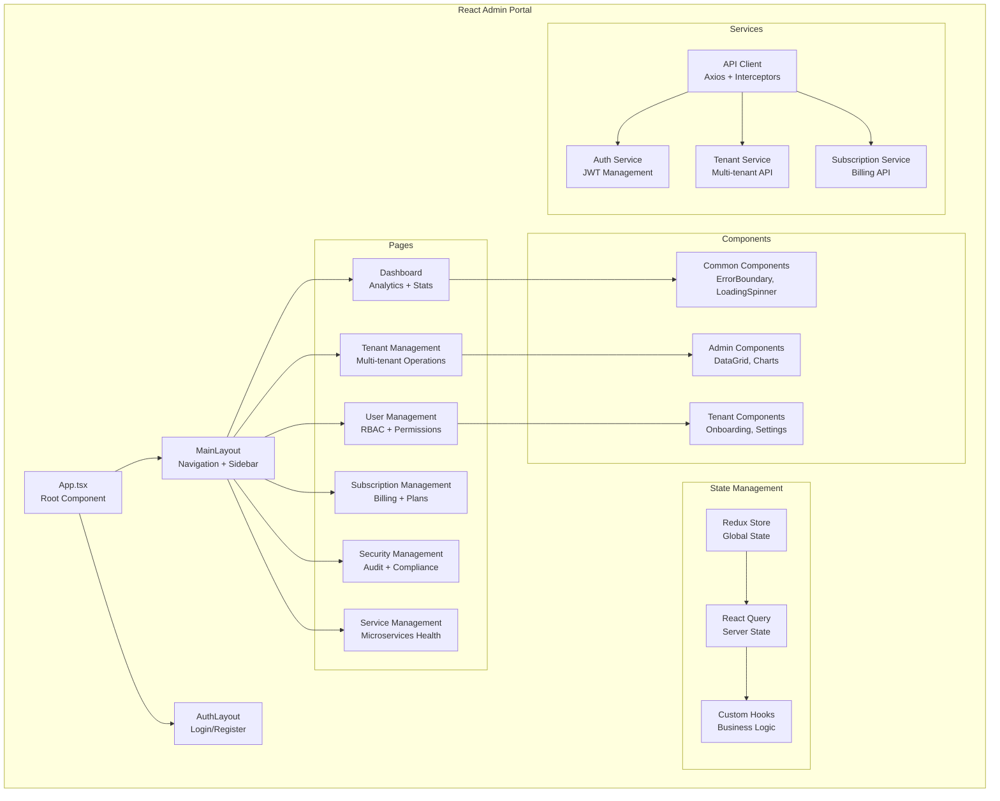
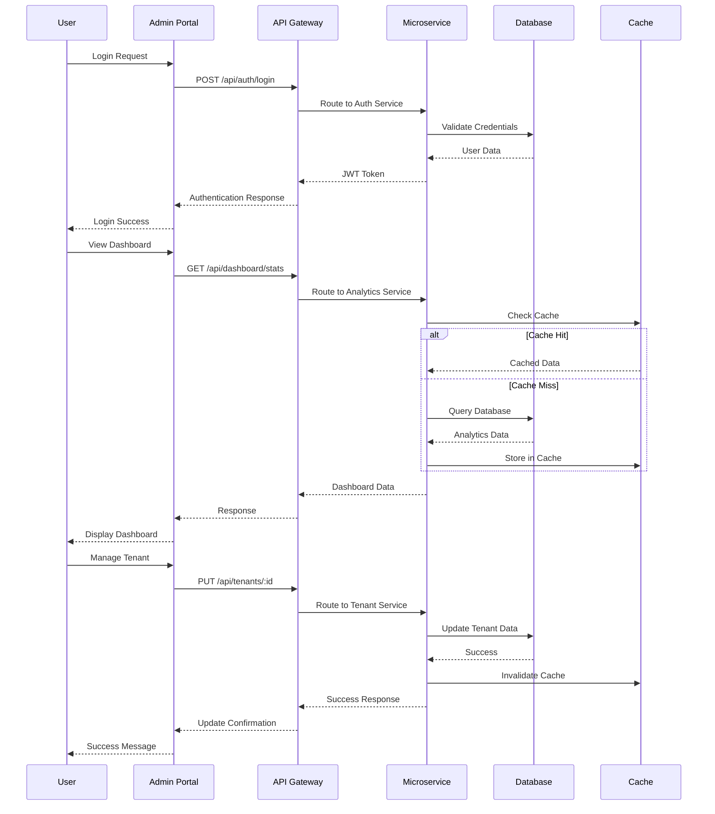
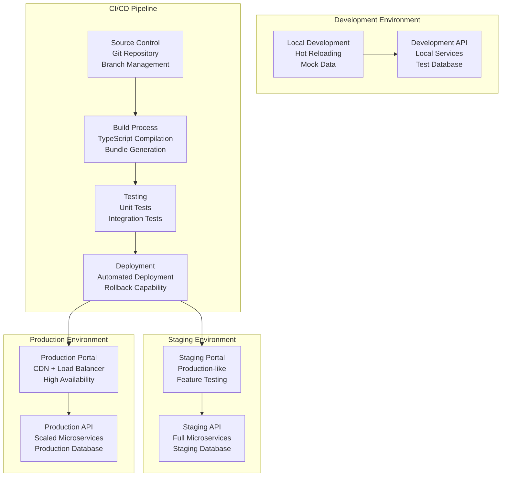

# STUDYSPOT Admin Portal - Architecture Diagram

## System Architecture Overview

## Frontend Architecture

## Microservices Architecture

```mermaid
graph TB
    subgraph "API Gateway"
        A[Express.js Gateway<br/>Authentication<br/>Rate Limiting<br/>Request Routing]
    end

    subgraph "Core Services"
        B[Auth Service<br/>JWT + MFA<br/>Session Management]
        C[Tenant Service<br/>Multi-tenant Operations<br/>Onboarding]
        D[User Service<br/>User Management<br/>Profile Management]
    end

    subgraph "Business Services"
        E[Subscription Service<br/>Billing Management<br/>Plan Management]
        F[Payment Service<br/>Stripe Integration<br/>Invoice Generation]
        G[Notification Service<br/>Email + SMS + Push<br/>Template Management]
        H[Communication Service<br/>Multi-channel Messaging<br/>Campaign Management]
    end

    subgraph "AI/ML Services"
        I[AI Service<br/>AI-powered Features<br/>Recommendations]
        J[ML Service<br/>Machine Learning<br/>Predictive Analytics]
        K[Analytics Service<br/>Data Analytics<br/>Business Intelligence]
        L[Face Recognition<br/>Biometric Authentication<br/>Fraud Detection]
    end

    subgraph "Infrastructure Services"
        M[Monitoring Service<br/>Health Checks<br/>Performance Metrics]
        N[Security Service<br/>RBAC + Permissions<br/>Audit Logging]
        O[Data Pipeline<br/>ETL Operations<br/>Data Processing]
        P[Encryption Service<br/>Data Encryption<br/>Key Management]
    end

    A --> B
    A --> C
    A --> D
    A --> E
    A --> F
    A --> G
    A --> H
    A --> I
    A --> J
    A --> K
    A --> L
    A --> M
    A --> N
    A --> O
    A --> P
```

## Data Flow Architecture

## Security Architecture

```mermaid
graph TB
    subgraph "Security Layers"
        A[Frontend Security<br/>Input Validation<br/>XSS Protection<br/>CSRF Protection]
        B[API Gateway Security<br/>Rate Limiting<br/>Authentication<br/>Authorization]
        C[Service Security<br/>JWT Validation<br/>Permission Checks<br/>Audit Logging]
        D[Data Security<br/>Encryption at Rest<br/>Encryption in Transit<br/>Access Controls]
    end

    subgraph "Authentication Flow"
        E[User Login<br/>Credentials]
        F[JWT Token Generation<br/>Access + Refresh]
        G[Token Validation<br/>Middleware]
        H[Permission Check<br/>RBAC System]
    end

    subgraph "Authorization System"
        I[Role Hierarchy<br/>Super Admin > Admin > Library Owner]
        J[Permission Matrix<br/>50+ Granular Permissions]
        K[Resource Access Control<br/>Tenant Isolation]
        L[Audit Trail<br/>All Actions Logged]
    end

    A --> B
    B --> C
    C --> D

    E --> F
    F --> G
    G --> H

    I --> J
    J --> K
    K --> L
```

## Performance Architecture

```mermaid
graph TB
    subgraph "Frontend Performance"
        A[Code Splitting<br/>Lazy Loading<br/>Route-based Chunks]
        B[Bundle Optimization<br/>Tree Shaking<br/>Minification]
        C[Caching Strategy<br/>Service Worker<br/>Local Storage]
        D[Performance Monitoring<br/>Web Vitals<br/>Real-time Metrics]
    end

    subgraph "Backend Performance"
        E[Load Balancing<br/>Multiple Instances<br/>Health Checks]
        F[Database Optimization<br/>Indexing<br/>Query Optimization]
        G[Caching Layer<br/>Redis Cache<br/>CDN Integration]
        H[Microservices Scaling<br/>Independent Scaling<br/>Resource Allocation]
    end

    subgraph "Infrastructure Performance"
        I[CDN<br/>Global Distribution<br/>Static Asset Caching]
        J[Database Sharding<br/>Horizontal Scaling<br/>Read Replicas]
        K[Monitoring<br/>APM Tools<br/>Alerting System]
        L[Auto-scaling<br/>Dynamic Resource Allocation<br/>Cost Optimization]
    end

    A --> B
    B --> C
    C --> D

    E --> F
    F --> G
    G --> H

    I --> J
    J --> K
    K --> L
```

## Deployment Architecture

This comprehensive architecture review provides a detailed analysis of the STUDYSPOT Admin Portal's architecture, highlighting its strengths, areas for improvement, and recommendations for future development.
