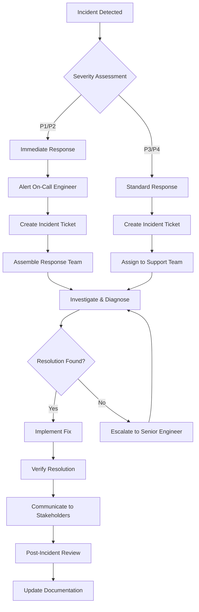
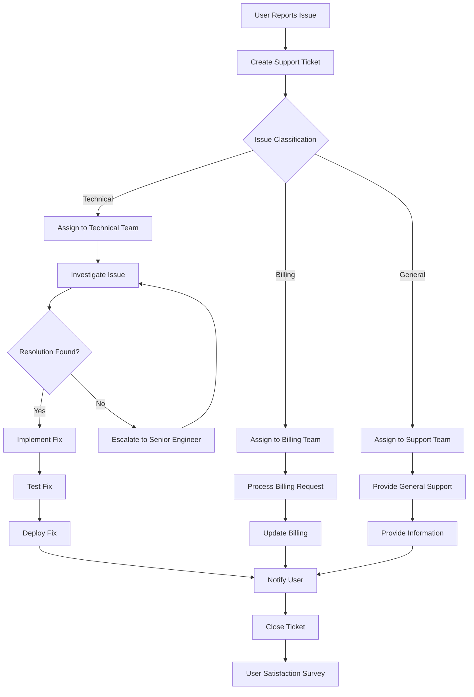

# 🔧 STUDYSPOT Platform - Maintenance & Support Procedures

## 📋 Table of Contents

1. [Maintenance Overview](#maintenance-overview)
2. [Monitoring & Alerting](#monitoring--alerting)
3. [Incident Management](#incident-management)
4. [System Maintenance](#system-maintenance)
5. [Database Maintenance](#database-maintenance)
6. [Security Maintenance](#security-maintenance)
7. [Performance Monitoring](#performance-monitoring)
8. [Backup & Recovery](#backup--recovery)
9. [User Support](#user-support)
10. [Documentation Maintenance](#documentation-maintenance)
11. [Compliance & Auditing](#compliance--auditing)
12. [Disaster Recovery](#disaster-recovery)

## 🎯 Maintenance Overview

### Maintenance Philosophy
- **Proactive Maintenance**: Prevent issues before they occur
- **Continuous Monitoring**: 24/7 system health monitoring
- **Automated Responses**: Automated incident response and recovery
- **Documentation-Driven**: All procedures documented and updated
- **User-Centric**: Minimize impact on user experience
- **Security-First**: Security considerations in all maintenance activities

### Maintenance Categories
- **Preventive Maintenance**: Regular system health checks and updates
- **Corrective Maintenance**: Fix issues as they arise
- **Adaptive Maintenance**: Adapt system to changing requirements
- **Perfective Maintenance**: Improve system performance and features

### Maintenance Schedule
- **Daily**: Health checks, log analysis, performance monitoring
- **Weekly**: Security scans, backup verification, capacity planning
- **Monthly**: System updates, security patches, performance optimization
- **Quarterly**: Comprehensive security audit, disaster recovery testing
- **Annually**: Technology stack review, compliance audit

---

## 📊 Monitoring & Alerting

### Monitoring Stack

#### Application Performance Monitoring
```yaml
# prometheus.yml
global:
  scrape_interval: 15s
  evaluation_interval: 15s

rule_files:
  - "rules/*.yml"

alerting:
  alertmanagers:
    - static_configs:
        - targets:
          - alertmanager:9093

scrape_configs:
  - job_name: 'studyspot-api'
    static_configs:
      - targets: ['studyspot-api:3000']
    metrics_path: '/metrics'
    scrape_interval: 5s

  - job_name: 'studyspot-web'
    static_configs:
      - targets: ['studyspot-web:80']
    metrics_path: '/metrics'
    scrape_interval: 5s

  - job_name: 'postgres'
    static_configs:
      - targets: ['postgres-exporter:9187']

  - job_name: 'redis'
    static_configs:
      - targets: ['redis-exporter:9121']
```

#### Alert Rules
```yaml
# rules/alerts.yml
groups:
  - name: studyspot.rules
    rules:
      - alert: HighErrorRate
        expr: rate(http_requests_total{status=~"5.."}[5m]) > 0.1
        for: 2m
        labels:
          severity: critical
        annotations:
          summary: "High error rate detected"
          description: "Error rate is {{ $value }} errors per second"

      - alert: HighResponseTime
        expr: histogram_quantile(0.95, rate(http_request_duration_seconds_bucket[5m])) > 1
        for: 5m
        labels:
          severity: warning
        annotations:
          summary: "High response time"
          description: "95th percentile response time is {{ $value }} seconds"

      - alert: DatabaseConnectionHigh
        expr: pg_stat_database_numbackends / pg_settings_max_connections > 0.8
        for: 2m
        labels:
          severity: warning
        annotations:
          summary: "High database connections"
          description: "Database connections are at {{ $value }}% of maximum"

      - alert: DiskSpaceLow
        expr: (node_filesystem_avail_bytes / node_filesystem_size_bytes) < 0.1
        for: 5m
        labels:
          severity: critical
        annotations:
          summary: "Low disk space"
          description: "Disk space is below 10% on {{ $labels.instance }}"

      - alert: MemoryUsageHigh
        expr: (node_memory_MemTotal_bytes - node_memory_MemAvailable_bytes) / node_memory_MemTotal_bytes > 0.9
        for: 5m
        labels:
          severity: warning
        annotations:
          summary: "High memory usage"
          description: "Memory usage is {{ $value }}% on {{ $labels.instance }}"
```

### Log Management

#### Log Aggregation
```yaml
# filebeat.yml
filebeat.inputs:
  - type: log
    enabled: true
    paths:
      - /var/log/studyspot/*.log
    fields:
      service: studyspot-api
    fields_under_root: true

output.elasticsearch:
  hosts: ["elasticsearch:9200"]
  index: "studyspot-logs-%{+yyyy.MM.dd}"

processors:
  - add_host_metadata:
      when.not.contains.tags: forwarded
```

#### Log Analysis Queries
```javascript
// Log analysis scripts
const elasticsearch = require('elasticsearch');

const client = new elasticsearch.Client({
  host: 'elasticsearch:9200'
});

// Error rate analysis
async function analyzeErrorRate() {
  const response = await client.search({
    index: 'studyspot-logs-*',
    body: {
      query: {
        bool: {
          must: [
            { range: { '@timestamp': { gte: 'now-1h' } } },
            { term: { level: 'ERROR' } }
          ]
        }
      },
      aggs: {
        errors_by_service: {
          terms: { field: 'service.keyword' }
        },
        errors_by_type: {
          terms: { field: 'error_type.keyword' }
        }
      }
    }
  });

  return response.aggregations;
}

// Performance analysis
async function analyzePerformance() {
  const response = await client.search({
    index: 'studyspot-logs-*',
    body: {
      query: {
        bool: {
          must: [
            { range: { '@timestamp': { gte: 'now-1h' } } },
            { exists: { field: 'response_time' } }
          ]
        }
      },
      aggs: {
        avg_response_time: {
          avg: { field: 'response_time' }
        },
        p95_response_time: {
          percentiles: { field: 'response_time', percents: [95] }
        }
      }
    }
  });

  return response.aggregations;
}
```

---

## 🚨 Incident Management

### Incident Response Process

#### Incident Classification
```yaml
Severity Levels:
  P1 - Critical:
    - Complete system outage
    - Data loss or corruption
    - Security breach
    - Payment system failure
    Response Time: 15 minutes
    Resolution Time: 2 hours

  P2 - High:
    - Major feature unavailable
    - Performance degradation > 50%
    - Partial system outage
    Response Time: 1 hour
    Resolution Time: 8 hours

  P3 - Medium:
    - Minor feature issues
    - Performance degradation < 50%
    - Non-critical system issues
    Response Time: 4 hours
    Resolution Time: 24 hours

  P4 - Low:
    - Cosmetic issues
    - Enhancement requests
    - Documentation issues
    Response Time: 24 hours
    Resolution Time: 1 week
```

#### Incident Response Workflow


### Incident Response Scripts

#### Automated Incident Detection
```bash
#!/bin/bash
# scripts/incident-detection.sh

# Check system health
check_system_health() {
    local status=0
    
    # Check API health
    if ! curl -f -s https://api.studyspot.com/health > /dev/null; then
        echo "CRITICAL: API health check failed"
        status=1
    fi
    
    # Check database connectivity
    if ! pg_isready -h $DB_HOST -p $DB_PORT > /dev/null; then
        echo "CRITICAL: Database connection failed"
        status=1
    fi
    
    # Check Redis connectivity
    if ! redis-cli -h $REDIS_HOST -p $REDIS_PORT ping > /dev/null; then
        echo "CRITICAL: Redis connection failed"
        status=1
    fi
    
    # Check disk space
    local disk_usage=$(df / | awk 'NR==2 {print $5}' | sed 's/%//')
    if [ $disk_usage -gt 90 ]; then
        echo "WARNING: Disk usage is ${disk_usage}%"
        status=1
    fi
    
    # Check memory usage
    local memory_usage=$(free | awk 'NR==2{printf "%.0f", $3*100/$2}')
    if [ $memory_usage -gt 90 ]; then
        echo "WARNING: Memory usage is ${memory_usage}%"
        status=1
    fi
    
    return $status
}

# Send alert
send_alert() {
    local message="$1"
    local severity="$2"
    
    # Send to PagerDuty
    curl -X POST https://events.pagerduty.com/v2/enqueue \
        -H "Content-Type: application/json" \
        -d "{
            \"routing_key\": \"$PAGERDUTY_ROUTING_KEY\",
            \"event_action\": \"trigger\",
            \"payload\": {
                \"summary\": \"$message\",
                \"severity\": \"$severity\",
                \"source\": \"studyspot-monitoring\"
            }
        }"
    
    # Send to Slack
    curl -X POST $SLACK_WEBHOOK_URL \
        -H "Content-Type: application/json" \
        -d "{
            \"text\": \"$severity: $message\",
            \"channel\": \"#alerts\"
        }"
}

# Main execution
main() {
    if ! check_system_health; then
        send_alert "System health check failed" "critical"
        exit 1
    fi
    
    echo "System health check passed"
    exit 0
}

main "$@"
```

#### Incident Response Automation
```bash
#!/bin/bash
# scripts/incident-response.sh

# Restart services
restart_services() {
    echo "Restarting services..."
    
    # Restart API service
    kubectl rollout restart deployment/studyspot-api -n studyspot
    
    # Restart web service
    kubectl rollout restart deployment/studyspot-web -n studyspot
    
    # Wait for rollout
    kubectl rollout status deployment/studyspot-api -n studyspot
    kubectl rollout status deployment/studyspot-web -n studyspot
    
    echo "Services restarted successfully"
}

# Scale up services
scale_up_services() {
    echo "Scaling up services..."
    
    # Scale API service
    kubectl scale deployment studyspot-api --replicas=5 -n studyspot
    
    # Scale web service
    kubectl scale deployment studyspot-web --replicas=3 -n studyspot
    
    echo "Services scaled up successfully"
}

# Clear caches
clear_caches() {
    echo "Clearing caches..."
    
    # Clear Redis cache
    redis-cli -h $REDIS_HOST -p $REDIS_PORT FLUSHALL
    
    # Clear CDN cache
    curl -X POST "https://api.cloudflare.com/client/v4/zones/$CF_ZONE_ID/purge_cache" \
        -H "Authorization: Bearer $CF_API_TOKEN" \
        -H "Content-Type: application/json" \
        -d '{"purge_everything":true}'
    
    echo "Caches cleared successfully"
}

# Main incident response
main() {
    local action="$1"
    
    case $action in
        "restart")
            restart_services
            ;;
        "scale")
            scale_up_services
            ;;
        "cache")
            clear_caches
            ;;
        "full")
            restart_services
            scale_up_services
            clear_caches
            ;;
        *)
            echo "Usage: $0 {restart|scale|cache|full}"
            exit 1
            ;;
    esac
}

main "$@"
```

---

## 🔧 System Maintenance

### Regular Maintenance Tasks

#### Daily Maintenance
```bash
#!/bin/bash
# scripts/daily-maintenance.sh

# Log rotation
rotate_logs() {
    echo "Rotating logs..."
    
    # Rotate application logs
    find /var/log/studyspot -name "*.log" -mtime +7 -delete
    
    # Rotate system logs
    logrotate /etc/logrotate.d/studyspot
    
    echo "Log rotation completed"
}

# Database maintenance
maintain_database() {
    echo "Performing database maintenance..."
    
    # Update table statistics
    psql $DATABASE_URL -c "ANALYZE;"
    
    # Vacuum tables
    psql $DATABASE_URL -c "VACUUM ANALYZE;"
    
    # Check for long-running queries
    psql $DATABASE_URL -c "
        SELECT pid, now() - pg_stat_activity.query_start AS duration, query 
        FROM pg_stat_activity 
        WHERE (now() - pg_stat_activity.query_start) > interval '5 minutes';
    "
    
    echo "Database maintenance completed"
}

# Cleanup temporary files
cleanup_temp_files() {
    echo "Cleaning up temporary files..."
    
    # Clean application temp files
    find /tmp -name "studyspot-*" -mtime +1 -delete
    
    # Clean Docker images
    docker system prune -f
    
    echo "Temporary files cleanup completed"
}

# Health check
health_check() {
    echo "Performing health check..."
    
    # Check API health
    curl -f -s https://api.studyspot.com/health || echo "API health check failed"
    
    # Check database health
    pg_isready -h $DB_HOST -p $DB_PORT || echo "Database health check failed"
    
    # Check Redis health
    redis-cli -h $REDIS_HOST -p $REDIS_PORT ping || echo "Redis health check failed"
    
    echo "Health check completed"
}

# Main execution
main() {
    echo "Starting daily maintenance..."
    
    rotate_logs
    maintain_database
    cleanup_temp_files
    health_check
    
    echo "Daily maintenance completed"
}

main "$@"
```

#### Weekly Maintenance
```bash
#!/bin/bash
# scripts/weekly-maintenance.sh

# Security scan
security_scan() {
    echo "Running security scan..."
    
    # Run npm audit
    npm audit --audit-level=high
    
    # Run container security scan
    docker run --rm -v /var/run/docker.sock:/var/run/docker.sock \
        aquasec/trivy image studyspot/api:latest
    
    echo "Security scan completed"
}

# Performance analysis
performance_analysis() {
    echo "Analyzing performance..."
    
    # Generate performance report
    artillery run artillery/performance-test.yml --output performance-report.json
    
    # Analyze slow queries
    psql $DATABASE_URL -c "
        SELECT query, mean_time, calls, total_time
        FROM pg_stat_statements
        ORDER BY mean_time DESC
        LIMIT 10;
    "
    
    echo "Performance analysis completed"
}

# Capacity planning
capacity_planning() {
    echo "Analyzing capacity..."
    
    # Check disk usage
    df -h
    
    # Check memory usage
    free -h
    
    # Check database size
    psql $DATABASE_URL -c "
        SELECT pg_size_pretty(pg_database_size(current_database()));
    "
    
    echo "Capacity analysis completed"
}

# Backup verification
verify_backups() {
    echo "Verifying backups..."
    
    # Check database backup
    aws s3 ls s3://studyspot-backups/database/ --recursive | tail -5
    
    # Check file backup
    aws s3 ls s3://studyspot-backups/files/ --recursive | tail -5
    
    # Test restore (dry run)
    aws s3 cp s3://studyspot-backups/database/latest.sql.gz /tmp/test-backup.sql.gz
    gunzip -t /tmp/test-backup.sql.gz
    rm /tmp/test-backup.sql.gz
    
    echo "Backup verification completed"
}

# Main execution
main() {
    echo "Starting weekly maintenance..."
    
    security_scan
    performance_analysis
    capacity_planning
    verify_backups
    
    echo "Weekly maintenance completed"
}

main "$@"
```

### System Updates

#### Automated Updates
```bash
#!/bin/bash
# scripts/update-system.sh

# Update dependencies
update_dependencies() {
    echo "Updating dependencies..."
    
    # Update npm packages
    npm update
    
    # Update Docker images
    docker pull studyspot/api:latest
    docker pull studyspot/web:latest
    
    echo "Dependencies updated"
}

# Deploy updates
deploy_updates() {
    echo "Deploying updates..."
    
    # Build new images
    docker build -t studyspot/api:latest ./api
    docker build -t studyspot/web:latest ./web
    
    # Deploy to staging
    kubectl set image deployment/studyspot-api api=studyspot/api:latest -n studyspot-staging
    kubectl set image deployment/studyspot-web web=studyspot/web:latest -n studyspot-staging
    
    # Wait for rollout
    kubectl rollout status deployment/studyspot-api -n studyspot-staging
    kubectl rollout status deployment/studyspot-web -n studyspot-staging
    
    # Run tests
    npm run test:staging
    
    echo "Updates deployed to staging"
}

# Production deployment
deploy_production() {
    echo "Deploying to production..."
    
    # Deploy to production
    kubectl set image deployment/studyspot-api api=studyspot/api:latest -n studyspot
    kubectl set image deployment/studyspot-web web=studyspot/web:latest -n studyspot
    
    # Wait for rollout
    kubectl rollout status deployment/studyspot-api -n studyspot
    kubectl rollout status deployment/studyspot-web -n studyspot
    
    echo "Production deployment completed"
}

# Rollback if needed
rollback() {
    echo "Rolling back deployment..."
    
    kubectl rollout undo deployment/studyspot-api -n studyspot
    kubectl rollout undo deployment/studyspot-web -n studyspot
    
    echo "Rollback completed"
}

# Main execution
main() {
    local environment="$1"
    
    case $environment in
        "staging")
            update_dependencies
            deploy_updates
            ;;
        "production")
            deploy_production
            ;;
        "rollback")
            rollback
            ;;
        *)
            echo "Usage: $0 {staging|production|rollback}"
            exit 1
            ;;
    esac
}

main "$@"
```

---

## 🗄️ Database Maintenance

### Database Optimization

#### Query Optimization
```sql
-- Analyze slow queries
SELECT 
    query,
    mean_time,
    calls,
    total_time,
    rows
FROM pg_stat_statements
ORDER BY mean_time DESC
LIMIT 20;

-- Check index usage
SELECT 
    schemaname,
    tablename,
    indexname,
    idx_scan,
    idx_tup_read,
    idx_tup_fetch
FROM pg_stat_user_indexes
ORDER BY idx_scan DESC;

-- Identify missing indexes
SELECT 
    schemaname,
    tablename,
    seq_scan,
    seq_tup_read,
    seq_tup_read / seq_scan AS avg_rows_per_scan
FROM pg_stat_user_tables
WHERE seq_scan > 0
ORDER BY seq_tup_read DESC;
```

#### Database Maintenance Scripts
```bash
#!/bin/bash
# scripts/database-maintenance.sh

# Reindex database
reindex_database() {
    echo "Reindexing database..."
    
    psql $DATABASE_URL -c "REINDEX DATABASE studyspot;"
    
    echo "Database reindexing completed"
}

# Update statistics
update_statistics() {
    echo "Updating database statistics..."
    
    psql $DATABASE_URL -c "ANALYZE;"
    
    echo "Statistics updated"
}

# Vacuum database
vacuum_database() {
    echo "Vacuuming database..."
    
    psql $DATABASE_URL -c "VACUUM ANALYZE;"
    
    echo "Database vacuuming completed"
}

# Check database health
check_database_health() {
    echo "Checking database health..."
    
    # Check connections
    psql $DATABASE_URL -c "
        SELECT count(*) as active_connections
        FROM pg_stat_activity
        WHERE state = 'active';
    "
    
    # Check locks
    psql $DATABASE_URL -c "
        SELECT count(*) as active_locks
        FROM pg_locks
        WHERE granted = false;
    "
    
    # Check database size
    psql $DATABASE_URL -c "
        SELECT 
            pg_size_pretty(pg_database_size(current_database())) as database_size,
            pg_size_pretty(pg_total_relation_size('bookings')) as bookings_size,
            pg_size_pretty(pg_total_relation_size('users')) as users_size;
    "
    
    echo "Database health check completed"
}

# Main execution
main() {
    echo "Starting database maintenance..."
    
    check_database_health
    update_statistics
    vacuum_database
    reindex_database
    
    echo "Database maintenance completed"
}

main "$@"
```

### Database Monitoring

#### Performance Monitoring
```sql
-- Create monitoring views
CREATE OR REPLACE VIEW database_performance AS
SELECT 
    'connections' as metric,
    count(*) as value
FROM pg_stat_activity
WHERE state = 'active'

UNION ALL

SELECT 
    'locks' as metric,
    count(*) as value
FROM pg_locks
WHERE granted = false

UNION ALL

SELECT 
    'database_size' as metric,
    pg_database_size(current_database()) as value;

-- Monitor slow queries
CREATE OR REPLACE VIEW slow_queries AS
SELECT 
    query,
    mean_time,
    calls,
    total_time,
    rows
FROM pg_stat_statements
WHERE mean_time > 1000  -- Queries taking more than 1 second
ORDER BY mean_time DESC;
```

---

## 🔒 Security Maintenance

### Security Monitoring

#### Security Audit Script
```bash
#!/bin/bash
# scripts/security-audit.sh

# Check for security vulnerabilities
check_vulnerabilities() {
    echo "Checking for security vulnerabilities..."
    
    # NPM audit
    npm audit --audit-level=high
    
    # Docker security scan
    docker run --rm -v /var/run/docker.sock:/var/run/docker.sock \
        aquasec/trivy image studyspot/api:latest
    
    # Check for outdated packages
    npm outdated
    
    echo "Vulnerability check completed"
}

# Check SSL certificates
check_ssl_certificates() {
    echo "Checking SSL certificates..."
    
    # Check certificate expiration
    echo | openssl s_client -servername api.studyspot.com -connect api.studyspot.com:443 2>/dev/null | \
        openssl x509 -noout -dates
    
    # Check certificate chain
    echo | openssl s_client -servername api.studyspot.com -connect api.studyspot.com:443 2>/dev/null | \
        openssl x509 -noout -issuer -subject
    
    echo "SSL certificate check completed"
}

# Check file permissions
check_file_permissions() {
    echo "Checking file permissions..."
    
    # Check sensitive files
    find /etc -name "*.pem" -o -name "*.key" -o -name "*.crt" | while read file; do
        perms=$(stat -c "%a" "$file")
        if [ "$perms" != "600" ] && [ "$perms" != "644" ]; then
            echo "WARNING: $file has permissions $perms"
        fi
    done
    
    echo "File permissions check completed"
}

# Check user accounts
check_user_accounts() {
    echo "Checking user accounts..."
    
    # Check for users with shell access
    awk -F: '$7 != "/usr/sbin/nologin" && $7 != "/bin/false" { print $1 }' /etc/passwd
    
    # Check for users with sudo access
    grep -E '^%sudo|^%admin' /etc/group
    
    echo "User accounts check completed"
}

# Main execution
main() {
    echo "Starting security audit..."
    
    check_vulnerabilities
    check_ssl_certificates
    check_file_permissions
    check_user_accounts
    
    echo "Security audit completed"
}

main "$@"
```

### Security Updates

#### Automated Security Updates
```bash
#!/bin/bash
# scripts/security-updates.sh

# Update system packages
update_system_packages() {
    echo "Updating system packages..."
    
    # Update package lists
    apt update
    
    # Upgrade packages
    apt upgrade -y
    
    # Clean up
    apt autoremove -y
    apt autoclean
    
    echo "System packages updated"
}

# Update application dependencies
update_application_dependencies() {
    echo "Updating application dependencies..."
    
    # Update npm packages
    npm update
    
    # Check for security updates
    npm audit fix
    
    echo "Application dependencies updated"
}

# Update Docker images
update_docker_images() {
    echo "Updating Docker images..."
    
    # Pull latest images
    docker pull studyspot/api:latest
    docker pull studyspot/web:latest
    
    # Remove old images
    docker image prune -f
    
    echo "Docker images updated"
}

# Main execution
main() {
    echo "Starting security updates..."
    
    update_system_packages
    update_application_dependencies
    update_docker_images
    
    echo "Security updates completed"
}

main "$@"
```

---

## 📈 Performance Monitoring

### Performance Metrics

#### Application Performance
```javascript
// Performance monitoring script
const prometheus = require('prom-client');

// Create metrics
const httpRequestDuration = new prometheus.Histogram({
  name: 'http_request_duration_seconds',
  help: 'Duration of HTTP requests in seconds',
  labelNames: ['method', 'route', 'status_code'],
  buckets: [0.1, 0.3, 0.5, 0.7, 1, 3, 5, 7, 10]
});

const httpRequestTotal = new prometheus.Counter({
  name: 'http_requests_total',
  help: 'Total number of HTTP requests',
  labelNames: ['method', 'route', 'status_code']
});

const activeConnections = new prometheus.Gauge({
  name: 'active_connections',
  help: 'Number of active connections'
});

// Performance monitoring middleware
function performanceMiddleware(req, res, next) {
  const start = Date.now();
  
  res.on('finish', () => {
    const duration = (Date.now() - start) / 1000;
    
    httpRequestDuration
      .labels(req.method, req.route?.path || req.path, res.statusCode)
      .observe(duration);
    
    httpRequestTotal
      .labels(req.method, req.route?.path || req.path, res.statusCode)
      .inc();
  });
  
  next();
}

module.exports = {
  performanceMiddleware,
  httpRequestDuration,
  httpRequestTotal,
  activeConnections
};
```

#### Database Performance
```sql
-- Database performance monitoring
CREATE OR REPLACE FUNCTION get_database_performance()
RETURNS TABLE (
    metric_name text,
    metric_value numeric
) AS $$
BEGIN
    RETURN QUERY
    SELECT 'active_connections'::text, count(*)::numeric
    FROM pg_stat_activity
    WHERE state = 'active'
    
    UNION ALL
    
    SELECT 'database_size'::text, pg_database_size(current_database())::numeric
    
    UNION ALL
    
    SELECT 'cache_hit_ratio'::text, 
           (sum(blks_hit) / (sum(blks_hit) + sum(blks_read))) * 100::numeric
    FROM pg_stat_database
    WHERE datname = current_database();
END;
$$ LANGUAGE plpgsql;
```

### Performance Optimization

#### Query Optimization
```sql
-- Identify slow queries
SELECT 
    query,
    mean_time,
    calls,
    total_time,
    rows,
    100.0 * shared_blks_hit / nullif(shared_blks_hit + shared_blks_read, 0) AS hit_percent
FROM pg_stat_statements
ORDER BY mean_time DESC
LIMIT 10;

-- Check index usage
SELECT 
    schemaname,
    tablename,
    indexname,
    idx_scan,
    idx_tup_read,
    idx_tup_fetch,
    idx_scan::float / (idx_scan + seq_scan) AS index_usage_ratio
FROM pg_stat_user_indexes
WHERE idx_scan + seq_scan > 0
ORDER BY index_usage_ratio DESC;

-- Analyze table statistics
SELECT 
    schemaname,
    tablename,
    n_tup_ins,
    n_tup_upd,
    n_tup_del,
    n_live_tup,
    n_dead_tup,
    last_vacuum,
    last_autovacuum,
    last_analyze,
    last_autoanalyze
FROM pg_stat_user_tables
ORDER BY n_dead_tup DESC;
```

---

## 💾 Backup & Recovery

### Backup Procedures

#### Automated Backup Script
```bash
#!/bin/bash
# scripts/backup.sh

# Database backup
backup_database() {
    echo "Starting database backup..."
    
    local timestamp=$(date +%Y%m%d_%H%M%S)
    local backup_file="studyspot_db_${timestamp}.sql"
    
    # Create database backup
    pg_dump $DATABASE_URL > /tmp/$backup_file
    
    # Compress backup
    gzip /tmp/$backup_file
    
    # Upload to S3
    aws s3 cp /tmp/${backup_file}.gz s3://studyspot-backups/database/
    
    # Clean up local file
    rm /tmp/${backup_file}.gz
    
    echo "Database backup completed: ${backup_file}.gz"
}

# File backup
backup_files() {
    echo "Starting file backup..."
    
    # Sync files to S3
    aws s3 sync s3://studyspot-files s3://studyspot-backups/files/ \
        --storage-class STANDARD_IA
    
    echo "File backup completed"
}

# Configuration backup
backup_configuration() {
    echo "Starting configuration backup..."
    
    local timestamp=$(date +%Y%m%d_%H%M%S)
    local config_file="studyspot_config_${timestamp}.tar.gz"
    
    # Create configuration backup
    tar -czf /tmp/$config_file /etc/studyspot/ /opt/studyspot/config/
    
    # Upload to S3
    aws s3 cp /tmp/$config_file s3://studyspot-backups/configuration/
    
    # Clean up local file
    rm /tmp/$config_file
    
    echo "Configuration backup completed: $config_file"
}

# Cleanup old backups
cleanup_old_backups() {
    echo "Cleaning up old backups..."
    
    # Keep last 30 days of database backups
    aws s3 ls s3://studyspot-backups/database/ | \
        awk '$1 < "'$(date -d "30 days ago" +%Y-%m-%d)'" {print $4}' | \
        xargs -I {} aws s3 rm s3://studyspot-backups/database/{}
    
    # Keep last 90 days of configuration backups
    aws s3 ls s3://studyspot-backups/configuration/ | \
        awk '$1 < "'$(date -d "90 days ago" +%Y-%m-%d)'" {print $4}' | \
        xargs -I {} aws s3 rm s3://studyspot-backups/configuration/{}
    
    echo "Old backups cleanup completed"
}

# Main execution
main() {
    echo "Starting backup process..."
    
    backup_database
    backup_files
    backup_configuration
    cleanup_old_backups
    
    echo "Backup process completed"
}

main "$@"
```

### Recovery Procedures

#### Database Recovery
```bash
#!/bin/bash
# scripts/restore-database.sh

restore_database() {
    local backup_file="$1"
    
    if [ -z "$backup_file" ]; then
        echo "Usage: $0 <backup_file>"
        echo "Available backups:"
        aws s3 ls s3://studyspot-backups/database/ | awk '{print $4}'
        exit 1
    fi
    
    echo "Restoring database from $backup_file..."
    
    # Download backup
    aws s3 cp s3://studyspot-backups/database/$backup_file /tmp/
    
    # Decompress backup
    gunzip /tmp/$backup_file
    
    # Restore database
    psql $DATABASE_URL < /tmp/${backup_file%.gz}
    
    # Clean up
    rm /tmp/${backup_file%.gz}
    
    echo "Database restore completed"
}

# Main execution
main() {
    restore_database "$1"
}

main "$@"
```

---

## 👥 User Support

### Support Ticket Management

#### Support Workflow


#### Support Scripts
```bash
#!/bin/bash
# scripts/support-tools.sh

# Check user account
check_user_account() {
    local email="$1"
    
    if [ -z "$email" ]; then
        echo "Usage: $0 check-user <email>"
        exit 1
    fi
    
    echo "Checking user account for $email..."
    
    psql $DATABASE_URL -c "
        SELECT 
            id,
            email,
            first_name,
            last_name,
            role,
            status,
            created_at,
            last_login
        FROM users 
        WHERE email = '$email';
    "
}

# Check user bookings
check_user_bookings() {
    local email="$1"
    
    if [ -z "$email" ]; then
        echo "Usage: $0 check-bookings <email>"
        exit 1
    fi
    
    echo "Checking bookings for $email..."
    
    psql $DATABASE_URL -c "
        SELECT 
            b.id,
            b.date,
            b.start_time,
            b.end_time,
            b.status,
            l.name as library_name,
            s.seat_number
        FROM bookings b
        JOIN users u ON b.user_id = u.id
        JOIN libraries l ON b.library_id = l.id
        JOIN seats s ON b.seat_id = s.id
        WHERE u.email = '$email'
        ORDER BY b.date DESC;
    "
}

# Check system status
check_system_status() {
    echo "Checking system status..."
    
    # API health
    echo "API Status:"
    curl -s https://api.studyspot.com/health | jq .
    
    # Database status
    echo "Database Status:"
    psql $DATABASE_URL -c "SELECT version();"
    
    # Redis status
    echo "Redis Status:"
    redis-cli -h $REDIS_HOST -p $REDIS_PORT ping
    
    echo "System status check completed"
}

# Main execution
main() {
    local command="$1"
    local parameter="$2"
    
    case $command in
        "check-user")
            check_user_account "$parameter"
            ;;
        "check-bookings")
            check_user_bookings "$parameter"
            ;;
        "system-status")
            check_system_status
            ;;
        *)
            echo "Usage: $0 {check-user|check-bookings|system-status} [parameter]"
            exit 1
            ;;
    esac
}

main "$@"
```

---

## 📚 Documentation Maintenance

### Documentation Updates

#### Documentation Review Process
```bash
#!/bin/bash
# scripts/documentation-review.sh

# Check for outdated documentation
check_outdated_docs() {
    echo "Checking for outdated documentation..."
    
    # Find documentation files
    find docs/ -name "*.md" -type f | while read file; do
        # Check if file was modified more than 30 days ago
        if [ $(find "$file" -mtime +30) ]; then
            echo "WARNING: $file may be outdated (last modified: $(stat -c %y "$file"))"
        fi
    done
    
    echo "Documentation review completed"
}

# Update API documentation
update_api_docs() {
    echo "Updating API documentation..."
    
    # Generate OpenAPI spec
    npm run generate-api-docs
    
    # Update Swagger UI
    cp api-docs.json docs/api/
    
    echo "API documentation updated"
}

# Check broken links
check_broken_links() {
    echo "Checking for broken links..."
    
    # Use linkchecker to find broken links
    linkchecker docs/ --check-extern
    
    echo "Link check completed"
}

# Main execution
main() {
    echo "Starting documentation review..."
    
    check_outdated_docs
    update_api_docs
    check_broken_links
    
    echo "Documentation review completed"
}

main "$@"
```

---

## 📋 Compliance & Auditing

### Compliance Monitoring

#### Audit Script
```bash
#!/bin/bash
# scripts/compliance-audit.sh

# Check data retention compliance
check_data_retention() {
    echo "Checking data retention compliance..."
    
    # Check for old user data
    psql $DATABASE_URL -c "
        SELECT count(*) as old_users
        FROM users 
        WHERE created_at < NOW() - INTERVAL '7 years'
        AND status = 'inactive';
    "
    
    # Check for old booking data
    psql $DATABASE_URL -c "
        SELECT count(*) as old_bookings
        FROM bookings 
        WHERE created_at < NOW() - INTERVAL '3 years';
    "
    
    echo "Data retention check completed"
}

# Check access logs
check_access_logs() {
    echo "Checking access logs..."
    
    # Check for failed login attempts
    grep "authentication failed" /var/log/studyspot/auth.log | wc -l
    
    # Check for suspicious activity
    grep "suspicious" /var/log/studyspot/security.log | wc -l
    
    echo "Access logs check completed"
}

# Check security compliance
check_security_compliance() {
    echo "Checking security compliance..."
    
    # Check SSL configuration
    echo | openssl s_client -servername api.studyspot.com -connect api.studyspot.com:443 2>/dev/null | \
        openssl x509 -noout -text | grep -E "Signature Algorithm|Public Key"
    
    # Check password policy
    psql $DATABASE_URL -c "
        SELECT count(*) as weak_passwords
        FROM users 
        WHERE length(password) < 8;
    "
    
    echo "Security compliance check completed"
}

# Main execution
main() {
    echo "Starting compliance audit..."
    
    check_data_retention
    check_access_logs
    check_security_compliance
    
    echo "Compliance audit completed"
}

main "$@"
```

---

## 🚨 Disaster Recovery

### Disaster Recovery Plan

#### Recovery Procedures
```bash
#!/bin/bash
# scripts/disaster-recovery.sh

# Full system recovery
full_system_recovery() {
    echo "Starting full system recovery..."
    
    # Restore infrastructure
    terraform apply -var-file="environments/production.tfvars"
    
    # Restore database
    restore_database "latest.sql.gz"
    
    # Restore files
    aws s3 sync s3://studyspot-backups/files/ s3://studyspot-files/
    
    # Deploy applications
    kubectl apply -f k8s/
    
    # Verify recovery
    verify_system_health
    
    echo "Full system recovery completed"
}

# Partial recovery
partial_recovery() {
    local component="$1"
    
    case $component in
        "database")
            restore_database "latest.sql.gz"
            ;;
        "files")
            aws s3 sync s3://studyspot-backups/files/ s3://studyspot-files/
            ;;
        "application")
            kubectl apply -f k8s/
            ;;
        *)
            echo "Usage: $0 partial-recovery {database|files|application}"
            exit 1
            ;;
    esac
}

# Verify system health
verify_system_health() {
    echo "Verifying system health..."
    
    # Check API health
    curl -f -s https://api.studyspot.com/health || echo "API health check failed"
    
    # Check database health
    pg_isready -h $DB_HOST -p $DB_PORT || echo "Database health check failed"
    
    # Check Redis health
    redis-cli -h $REDIS_HOST -p $REDIS_PORT ping || echo "Redis health check failed"
    
    echo "System health verification completed"
}

# Main execution
main() {
    local command="$1"
    local parameter="$2"
    
    case $command in
        "full")
            full_system_recovery
            ;;
        "partial")
            partial_recovery "$parameter"
            ;;
        "verify")
            verify_system_health
            ;;
        *)
            echo "Usage: $0 {full|partial|verify} [component]"
            exit 1
            ;;
    esac
}

main "$@"
```

### Recovery Testing

#### Disaster Recovery Test
```bash
#!/bin/bash
# scripts/dr-test.sh

# Test backup restoration
test_backup_restoration() {
    echo "Testing backup restoration..."
    
    # Create test database
    createdb studyspot_dr_test
    
    # Restore latest backup
    aws s3 cp s3://studyspot-backups/database/latest.sql.gz /tmp/
    gunzip -c /tmp/latest.sql.gz | psql studyspot_dr_test
    
    # Verify data integrity
    psql studyspot_dr_test -c "SELECT count(*) FROM users;"
    psql studyspot_dr_test -c "SELECT count(*) FROM bookings;"
    
    # Clean up
    dropdb studyspot_dr_test
    rm /tmp/latest.sql.gz
    
    echo "Backup restoration test completed"
}

# Test failover procedures
test_failover() {
    echo "Testing failover procedures..."
    
    # Simulate primary database failure
    kubectl scale deployment postgres-primary --replicas=0 -n studyspot
    
    # Wait for failover
    sleep 30
    
    # Check if secondary is promoted
    kubectl get pods -n studyspot | grep postgres
    
    # Restore primary
    kubectl scale deployment postgres-primary --replicas=1 -n studyspot
    
    echo "Failover test completed"
}

# Test application recovery
test_application_recovery() {
    echo "Testing application recovery..."
    
    # Scale down applications
    kubectl scale deployment studyspot-api --replicas=0 -n studyspot
    kubectl scale deployment studyspot-web --replicas=0 -n studyspot
    
    # Scale up applications
    kubectl scale deployment studyspot-api --replicas=3 -n studyspot
    kubectl scale deployment studyspot-web --replicas=2 -n studyspot
    
    # Wait for rollout
    kubectl rollout status deployment/studyspot-api -n studyspot
    kubectl rollout status deployment/studyspot-web -n studyspot
    
    # Verify health
    curl -f -s https://api.studyspot.com/health
    
    echo "Application recovery test completed"
}

# Main execution
main() {
    echo "Starting disaster recovery test..."
    
    test_backup_restoration
    test_failover
    test_application_recovery
    
    echo "Disaster recovery test completed"
}

main "$@"
```

---

**Document Version**: 1.0.0  
**Last Updated**: [Current Date]  
**Next Review**: [Next Review Date]  
**Maintenance Version**: v1.0


